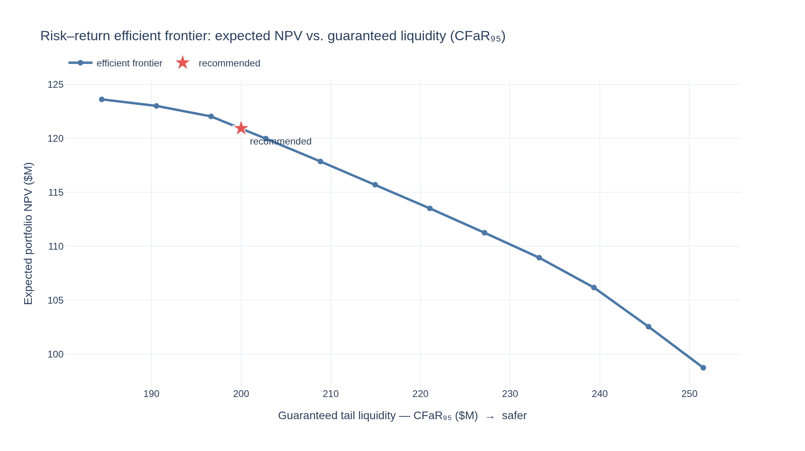
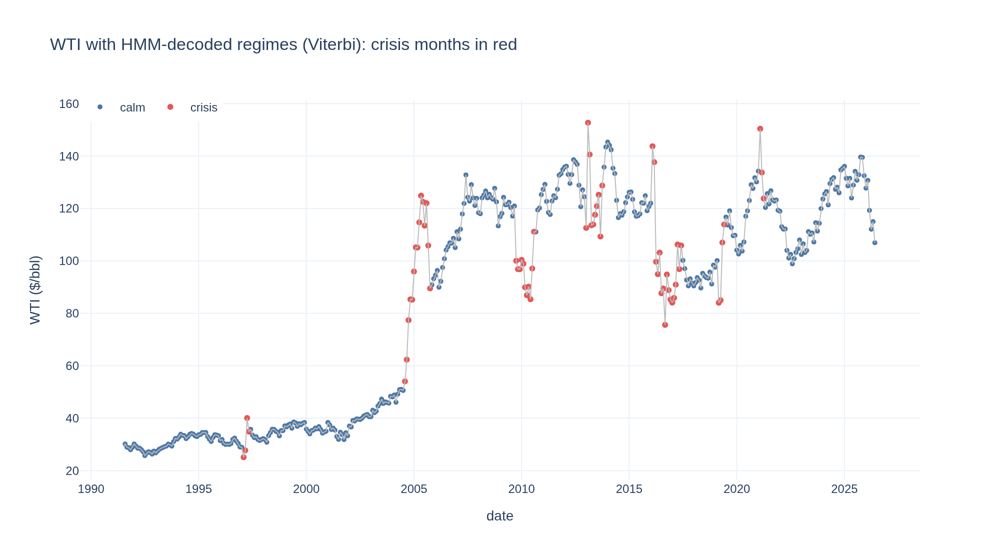
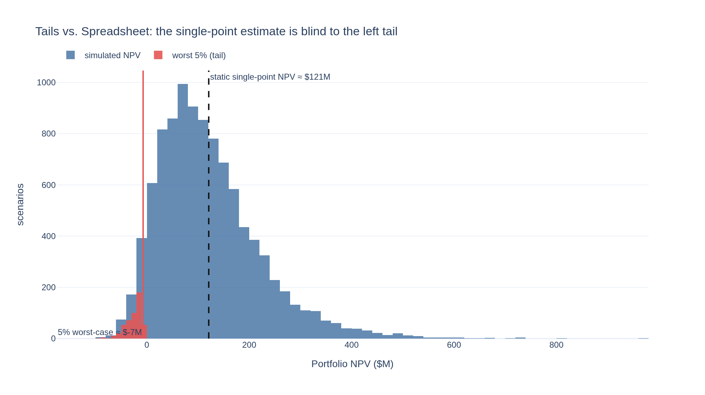

# Probabilistic Financial Forecasting & Hybrid Accounting Engine


A quantitative engine for allocating a multi-year CapEx budget across competing
energy/industrial projects **under macroeconomic uncertainty** — bridging
probabilistic ML, quantitative finance, deterministic accounting, and stochastic
optimization.

> **The architectural bet:** keep the accounting identities and discounting **100 %
> deterministic and auditable** (GAAP-style, zero drift), while driving their
> inputs with Bayesian simulation. A spreadsheet gives one NPV and hides the tail;
> this engine quantifies **Cash-Flow-at-Risk (CFaR)** across 10,000+ simulated
> market states and optimizes the allocation against it.

<p align="center">
  
</p>

*The decision a capital committee actually makes: how much expected NPV to trade
for how much guaranteed liquidity. Every point is a re-solved convex allocation.*

---

## Why

Traditional corporate-finance models are static spreadsheets: single-point
assumptions in, a single NPV out. They break when simultaneous shocks — an oil
spike, a rate hike, cost inflation — interact and threaten debt covenants. This
engine keeps the parts that *must* be exact (accounting identities, discounting)
deterministic and auditable, and injects uncertainty only where it belongs: in
the macro drivers.

## The four pillars

| # | Pillar | Tech | Status |
|---|--------|------|--------|
| 1 | **Probabilistic drivers** — regime-switching HMM of commodity prices → Monte-Carlo trajectories with honest P10/P50/P90 | NumPyro / JAX | ✅ built |
| 2 | **Term structure & debt** — bootstrap yield curves, Vasicek short rates, floating-rate debt service | QuantLib | ✅ built |
| 3 | **Deterministic accounting** — balanced 3-statement articulation (Revenue → FCFF → NPV), vectorized, golden-tested | NumPy / JAX | ✅ built |
| 4 | **Stochastic allocation** — convex capital budgeting under a CFaR floor | CVXPY | ✅ built |

Plus **causally-correct scenario analysis**: named what-ifs (SOFR +200bp, WTI −30%),
tornado sensitivity, and a reverse stress test, all applied as `do()` *interventions*
over a hand-specified macro DAG — not observational conditioning.

Validation: purged + embargoed rolling-origin backtesting (López de Prado, *AFML*
Ch. 7), interval coverage / pinball loss, and policy replay across historical
stress windows — culminating in a mock CFO decision deck.

## What it demonstrates

**Accounting that balances by construction — and proves it.** The 3-statement
engine is a vectorized roll-forward where ΔAssets ≡ ΔLiabilities + ΔEquity every
period; golden identity tests (`assert_balanced`) run in CI *and* inside the
pipeline on every run.

**A driver that models regimes, not a random walk.** A Bayesian Gaussian HMM fit
with NUTS (discrete states marginalized via the forward algorithm) captures calm
vs. crisis volatility — and puts materially more mass in the tails than the
matched GBM it replaces.

<p align="center">
  
  
</p>

**Risk-aware optimization.** Capital is allocated by a convex program that
maximizes expected portfolio NPV subject to the budget, per-project caps, and a
**Cash-Flow-at-Risk floor** encoded via the Rockafellar–Uryasev CVaR
linearization — so the recommendation and the efficient frontier are *computed*,
not asserted.

## Quickstart

```bash
python -m venv .venv && source .venv/bin/activate
pip install -e '.[dev]'          # core + tests (fast; no heavy pillars)
pip install -r requirements.txt  # full 4-pillar stack (NumPyro, CVXPY, QuantLib, …)

python -m fce                    # MVP accounting slice (Pillar 3)
python -m fce --allocate         # CFaR-constrained allocation (Pillars 3+4)
python -m fce --allocate --hmm   # drive it with the NumPyro HMM (Pillar 1)
python -m fce --allocate --hmm --quantlib   # + term-structure discounting & floating debt (Pillar 2)
python -m fce --report --hmm     # CFO-ready executive summary in Markdown (Pillar 5)
python -m fce --validate         # model-validation report: curve repricing, PPC, VaR backtest
pytest                           # 44 tests: golden identities, leakage-free splits, model recovery, curve/debt, validators
```

No API keys required to run — the driver falls back to a reproducible synthetic
WTI series offline. For real data, copy `.env.example` to `.env` and add free
[EIA](https://www.eia.gov/opendata/) and [FRED](https://fred.stlouisfed.org/docs/api/)
keys.

## Notebooks

Each pillar ships an executable tutorial notebook whose claims are grounded in
canonical references (Berk & DeMarzo, Hilpisch, Dixon et al., López de Prado,
Rockafellar & Uryasev):

- [`01_deterministic_accounting_core.ipynb`](notebooks/01_deterministic_accounting_core.ipynb) — FCFF, balances-by-construction, golden identities, Monte-Carlo NPV.
- [`02_capital_allocation_cfar.ipynb`](notebooks/02_capital_allocation_cfar.ipynb) — risk-return frontier, recommended allocation, "Tails vs. Spreadsheet" *(Plotly)*.
- [`03_probabilistic_drivers_hmm.ipynb`](notebooks/03_probabilistic_drivers_hmm.ipynb) — regime decoding, posterior-predictive fan, HMM vs. GBM tails *(Plotly)*.
- [`04_term_structure_quantlib.ipynb`](notebooks/04_term_structure_quantlib.ipynb) — bootstrapped curve, Vasicek short-rate fan, floating-debt sensitivity *(Plotly)*.
- [`05_scenarios_causal_stress.ipynb`](notebooks/05_scenarios_causal_stress.ipynb) — macro DAG, do-vs-conditioning, named scenarios, tornado, reverse-stress heatmap *(Plotly)*.

## Executive deck

The pillars culminate in a mock CFO / capital-allocation-committee presentation:

- [`deck/DECK.md`](deck/DECK.md) — 12-slide boardroom narrative with speaker script,
  anticipated Q&A, and a methodology appendix, illustrated by the exported pillar figures.
- [`deck/EXECUTIVE_SUMMARY.md`](deck/EXECUTIVE_SUMMARY.md) — the committed snapshot of
  `python -m fce --report --hmm`; every headline number in the deck traces to it.

## Validation — are the *metrics* trustworthy?

Unit tests prove the code is correct; a separate layer (`fce/validate/`) proves the
*numbers* are calibrated — the distinction an SR 11-7 model-risk review turns on.
Each validator maps a produced metric to a textbook technique, and each is
demonstrated to have diagnostic *power* (a deliberately misspecified model is
flagged, not just passed):

- **Curve repricing** — the bootstrapped term structure reprices its own deposit
  and swap inputs to ~0 bp (a pure round-trip; Ma Weiming Ch. 5, Swindle §7).
- **Posterior predictive checks** — the HMM reproduces the data's fat tails,
  volatility clustering, and worst drawdown; a single-vol (GBM-like) model fails
  the kurtosis and clustering checks (McElreath Ch. 3; Martin et al. Ch. 2 & 9).
- **VaR exceedance backtest** — the driver's one-step 95% VaR is breached ~5% of
  the time, with **Kupiec** (unconditional) and **Christoffersen** (conditional)
  coverage tests both passing (Edwards pp. 430–436; Handbook of Energy Trading §5).

Run `python -m fce --validate` for the report; snapshot in
[`deck/VALIDATION_REPORT.md`](deck/VALIDATION_REPORT.md). Quantile calibration
(interval coverage, pinball loss) lives with the driver's statistical loop in
`fce/backtest/`.

## Project layout

```
fce/
  ingest/         # EIA + FRED clients, pinned-vintage parquet cache
  drivers/        # Pillar 1 — NumPyro regime-switching HMM
  term_structure/ # Pillar 2 — QuantLib curves + Vasicek rates + floating debt
  accounting/     # Pillar 3 — deterministic 3-statement engine + golden tests
  optimize/       # Pillar 4 — CVXPY allocation + Rockafellar–Uryasev CFaR
  scenarios/      # what-if / macro-SCM do()-interventions, tornado, reverse stress
  validate/       # metric validation — curve repricing, HMM PPC, VaR/Kupiec backtest
  backtest/       # purged + embargoed CV, coverage/pinball
  projects.py     # the 5 synthetic projects → scenario simulation
  report.py       # Pillar 5 — CFO executive-summary reporter
  pipeline.py     # orchestrator-agnostic entrypoints
notebooks/        # tutorials + exported deck figures
deck/             # boardroom narrative + committed executive-summary snapshot
tests/            # golden identities, split leakage, optimizer, model recovery
```

## Roadmap

- **Executive deck** — ✅ drafted: [`deck/DECK.md`](deck/DECK.md) assembles the exported
  pillar figures (frontier, tails-vs-spreadsheet, regimes, term structure, causal stress)
  into an SR 11-7-framed CFO narrative.
- **Historical policy replay** — backtest the recommended allocation across real stress
  windows (2008, 2014–16 oil crash, 2020, 2022 rate spike) with purged + embargoed CV.

## License

[MIT](LICENSE) © 2026 Willie Man
